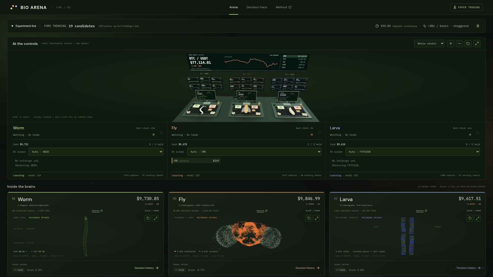
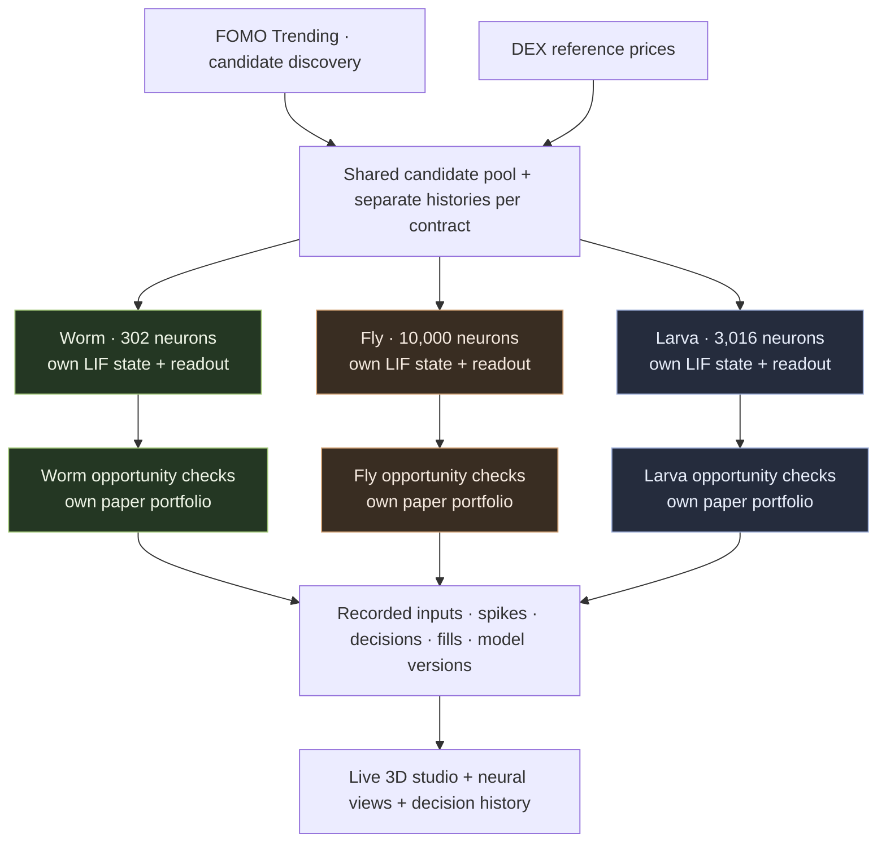
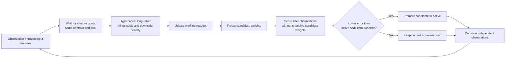

# MultiBioArena

**Three biological connectomes. Independent decisions. One shared market.**

Worm, Fly, and Larva observe the same candidate market, run their own neural simulations, and manage separate paper portfolios. Follow a token from sensory input to neural activity, a trading decision, and a recorded fill in a live 3D trading studio.

[Website](https://multibioarena.fun/) · [Live preview](https://multi-bio-arena.vercel.app/) · [Broadcast view](https://multibioarena.fun/?broadcast=1) · [Methodology](docs/methodology.md) · [Data sources](docs/data-sources.md) · [Development](docs/development.md)

The custom domain is live with HTTPS; `www` redirects to the main site. See [domain configuration](docs/domain.md).



*A captured paper run. The live dashboard changes with market observations; the image is not a performance benchmark.*

## Meet the agents

| Agent | Biological model | Simulated neurons | Directed chemical connections |
| --- | --- | ---: | ---: |
| **Worm** | Adult hermaphrodite *C. elegans* | 302 | 3,709 |
| **Fly** | Adult *D. melanogaster* subnetwork, FlyWire v783 | 10,000 | 1,328,439 |
| **Larva** | First-instar *D. melanogaster* brain and inputs | 3,016 | 107,344 |

Three biological models, two species. A shared **Leaky Integrate-and-Fire (LIF) engine** means shared numerical code. Each worker has separate membrane potentials, synaptic currents, delay queues, random state, decision readout, and account. Worm also includes electrical coupling.

The source versions, hashes, neuron selection, sign assumptions, and geometry transformations are recorded. [Explore the original datasets and preprocessing](docs/data-sources.md).

## How the arena works



### One check, from market input to a trade

1. **Observe independently.** Each agent has a staggered schedule near 30 seconds with its own seeded jitter. It reviews its fresh-priced holdings and up to three rotating new candidates. Agents may select different tokens or the same one.
2. **Encode the market.** Positive return, negative return, volume, and volatility become bounded stimuli injected into annotated sensory pools. Every contract has its own history and feature encoder.
3. **Run the connectome.** An observation advances 200 ms of neural time at 0.1 ms steps. Average activity in two readout pools produces a calibrated contrast. Calibration uses synthetic stimuli, not trading profits.
4. **Choose an opportunity.** The readout and market features estimate an advantage after modeled costs. Risk exits take priority, followed by ordinary exits and eligible entries. Insufficient evidence, stale data, cooldowns, or exposure limits lead to **HOLD**. Limited paper exploration can investigate an eligible token.
5. **Settle and record.** BUY or SELL waits for a fresh quote for that contract after the decision. Portfolio checks run again at settlement. Missing prices produce an unfilled record; they never become a fabricated execution.

A neural BUY signal is evidence for the policy, not an order by itself. Each record keeps the neural signal, final intent, eligibility checks, execution quote, and fill result separately. Click a Bio or filter **Decisions & fills** to inspect its history.

### What learns

Each agent trains an independent **ten-feature linear readout**. The biological graph stays fixed. Its features include neural contrast and rates, past price movement, volume, volatility, liquidity, and estimated costs.



The default label horizon is **300 seconds**, with a 120-second grace window. After at least 24 training samples, a frozen candidate must improve squared prediction error by more than 5% against both the active model and a zero baseline over 12 later samples. These are checks on predictions, not proof of profitable trading. Labels can come from observed tokens that were never bought; actual portfolio returns are recorded separately.

Before the first promotion, a labeled neural/momentum prior guides selection. Small paper exploration is capped at 3% of equity per allocation. Trading more often earns no reward. [Read the learning target and validation details](docs/methodology.md#what-learns).

### Default paper rules

| Setting | Default |
| --- | --- |
| Initial capital | $10,000 virtual USD per agent |
| Positions | Up to 5 per agent |
| Ordinary allocation | 12% of equity, subject to capacity and exposure checks |
| Exposure caps at entry | 20% per token; 60% total |
| Observation cadence | About 30 seconds, with independent ±5-second jitter |
| Trade cooldown / ordinary minimum hold | 60 seconds / 120 seconds |
| Entry liquidity / 5-minute volume | At least $50,000 / $500 |
| Quote freshness | At most 30 seconds |
| Estimated order costs | 50 bps fee + 50 bps base slippage + pool impact + $0.20 network cost |
| Risk exits | 15% position drawdown; account exit at 20% of initial equity |

These are configurable paper-model assumptions. Capacity limits can cause partial exits, and missing quotes can leave an exit pending. See [configs/fomo.yaml](configs/fomo.yaml) and [portfolio mechanics](docs/methodology.md#paper-portfolios).

## What the visualization means

- **Worm:** a body-axis atlas with 300 matched positions for 302 simulated neurons.
- **Fly:** 14,000 measured soma positions: 9,304 simulated cells and 4,696 static reference cells.
- **Larva:** real left/right identities and homologous pairs in a bilateral organizational layout. Its two ribbons are schematic coordinates; both sides belong to one connected neural simulation.

Brief pulses replay recorded activity, and selected-cell edges come from the simulated graph. Every neural view links to research sources.

The studio's BUY and SELL gestures illustrate recorded decisions. Walking, flight, prop interactions, and ambient particles are presentation effects; they do not train the readout, place orders, or delay backend execution. HOLD produces no button press. The rear BTC / ETH / SOL / stock screen is a separate display feed and does not enter the trading inputs. [Component attribution](docs/component-sources.md).

## Run locally

The tested stack is Linux, Python 3.12, Node.js 22, React, TypeScript, and Three.js.

```bash
git clone https://github.com/MultiBioArena/BioArena.git
cd BioArena
python3 -m venv .venv
.venv/bin/pip install -r requirements.lock
.venv/bin/pip install -e . --no-deps
.venv/bin/python scripts/fetch_data.py
.venv/bin/python scripts/preprocess.py
.venv/bin/python scripts/build_neural_geometry.py
OPENBLAS_NUM_THREADS=1 .venv/bin/python scripts/calibrate.py
cd frontend
npm ci
cd ..
```

Start the **SOL/USDT baseline** in one terminal:

```bash
BIO_ARENA_CONFIG=configs/arena.yaml bash scripts/serve.sh
```

Start the dashboard in another:

```bash
cd frontend
npm run dev
```

Open the URL printed by Vite. Its proxy connects to the arena on port 8140. For the optional rear market screen, run `bash scripts/serve_market_board.sh` in another terminal.

This baseline requires no FOMO account and uses a fixed opportunity policy. The **multi-token learner** uses `configs/fomo.yaml` and requires a separately prepared discovery session. [Set up the optional FOMO integration](docs/market-integration.md).

## Verification and reproducibility

```bash
# Offline checks: no connectome downloads or FOMO login required
.venv/bin/pytest -q -m 'not requires_data'

# Full scientific suite, after the data preparation above
.venv/bin/pytest -q
node scripts/check_desk_playback.mjs
node scripts/check_desk_motion.mjs
node scripts/check_candidate_screens.mjs
npm run build --prefix frontend
```

Run `bash scripts/check.sh` for the offline tests and frontend checks, or `bash scripts/check.sh --full` for the full suite after scientific data preparation. Tests cover numerical dynamics, causal features, account isolation, cost arithmetic, delayed labels, model promotion, history pagination, candidate-cache retention, and lifecycle cleanup.

Each run records configuration, source/code hashes, seeds, quotes, observations, decisions, fills, model events, and checkpoints. `scripts/replay.py` and `scripts/replay_fomo.py` check recorded neural results and fill arithmetic. Exact replay requires matching code, data, parameters, and numerical dependencies.

**New runs support explicit recovery from complete decision-boundary bundles.** Set `BIO_ARENA_RESUME=RUN_ID` to fork a compatible saved run with accounts, neural state and learned readout restored. An explicit paused-stop migration now preserves the earlier experiment’s portfolios, brains and models, with documented market/feature warmup and scheduler resets. The active backend has been migrated and a subsequent recovery restart verified. [Recovery details](docs/recovery-and-evaluation.md). Browser storage, credentials, and experiment logs are excluded from this repository. [Development and replay guide](docs/development.md).

## Resources and scope

Scientific downloads total about 139 MiB; processed graphs occupy about 7.2 MiB. Start with 2–4 CPU threads and 2–4 GiB RAM for runtime, with 8–16 GiB available for preprocessing. Browser rendering and growing logs add their own costs. These are planning estimates, not sustained-load guarantees.

LIF is a common approximation, especially for the largely graded-potential neurons of *C. elegans*. Cropped connectivity, sign assumptions, observation order, and engineered market mappings influence results. Three agents alone cannot establish biological fairness, causality, or trading profitability. Dataset reuse remains subject to the upstream terms, including the documented FlyWire noncommercial license.

## Preparing for live FOMO trading

**We are preparing for live trading on FOMO with three independent agent accounts.** The website uses paper trading. A separate browser executor follows Bio decisions, with quote rehearsal as its default. On 2026-09-12, Fly completed one operator-started funded BUY/full-SELL acceptance check after recovery from earlier execution defects. Strategy-driven real trading and the other two accounts remain unverified.

The executor supports **up to two distinct held tokens per agent and at most 10 USD per buy**, with separate quoted-cost limits. [Managed position trials](docs/managed-positions.md) retain exit requests, track actual entry costs and quantities, and keep handling exits after the entry window closes. Exploration entries and exit cooldowns are configurable. This path has isolated two-buy/two-sell tests; funded managed-portfolio validation remains pending. The paper service cannot enable real execution. [Execution mechanism and commands](docs/execution-preparation.md).

An opt-in [live execution preview](docs/live-preview.md) shows reported trial states, executor-owned holdings and real order receipts alongside the paper strategy signal. Its main 3D monitors can display [actual FOMO browser snapshots](docs/fomo-browser-screens.md), with an enlarged, zoomable read-only view. Creatures stay at their desks and replay newly verified real fills. The production site remains the paper arena. Live account equity and real-fill learning feedback remain pending.

The operator can also run a dedicated [execution acceptance check](docs/execution-preparation.md#execution-acceptance-check): an explicitly selected token is bought and fully sold with receipt verification, independently of Bio strategy timing. This check defaults to a quote rehearsal, requires an explicit real-execution flag, and does not count as a Bio decision or a learning result. Fly's first pass matched Relay success, the exact entry/exit quantity, actual cash changes and an empty final holding. It does not establish profitability or unattended reliability.

[Two separate acceptance gates](docs/execution-preparation.md#two-separate-acceptance-gates) distinguish execution capability from strategy-driven trading. A subsequent strategy trial can require the first check's verified result, records why each observed signal advances or is filtered, and passes only after its own matching BUY and SELL. Each agent/account requires separate funded evidence; no qualifying signal means the trading path was not exercised.

### Hourly challenge and EVM predictions — testing, hidden

A separate audience module has been built and locally tested for a possible future update. It compares **hourly percentage losses**, so accounts with different starting balances can compete. The calculation core covers external deposits/withdrawals, insolvency, ties and invalid rounds; live valuation and transfer reconciliation still require integration. Trading learners continue seeking returns after costs and risk.

The hidden preview supports one EVM-address prediction per round, an early voting cutoff, persistent receipts and aggregate results. Paper test votes do not check holdings or qualify for rewards. A read-only ERC-20 holder gate is prepared for a configured launch network, RPC and token; entering an address does not prove wallet ownership. Reward distribution is not implemented.

**This feature is not enabled on the public dashboard.** We may release it in stages after further testing. See [hourly rules, EVM voting and release preparation](docs/hourly-challenge.md).

## Operations and release notes

The local launcher defaults to `configs/fomo.yaml`; the baseline command above explicitly selects SOL. Browser account assignments are saved privately and are excluded from Git. See [execution setup](docs/execution-preparation.md), [operations](docs/operations.md), and [verification status](docs/requirements-status.md).

A retained compatibility table translates legacy recorded reason strings. Public distribution uses English source strings and an independently maintained history. Never copy operator state, browser profiles, or credentials into the public tree.

## Implementation status

[Requirement-by-requirement audit](docs/requirements-status.md) distinguishes deployed features, tested code, hidden previews and remaining verification. Paper recovery and recorded activity are active. The latest update adds [boot services, hang recovery and verified archival](docs/operations.md), [seeded policy comparisons](docs/policy-comparison.md), and [confirmed ERC-20 capital-flow infrastructure](docs/capital-flows.md). Configurable participants and the hidden prediction sandbox remain available. The active backend now runs the activity policy and complete recovery; the earlier accounts and trained models were retained. The separate FOMO executor requires operator startup. Fly's funded execution check has passed; strategy-driven round trips and the other accounts still need verification. Wallet-funded predictions and rewards remain unconnected.
