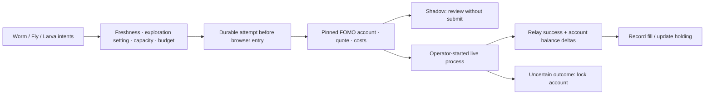

# FOMO automatic execution

**The website still runs paper trading.** A separate, operator-started browser executor consumes Bio decisions and defaults to **shadow** mode. On 2026-09-12, Fly completed one funded execution acceptance check after recovery from earlier confirmation and page-control failures. A strategy-driven real round trip remains unverified. Quote rehearsal and local fixtures do not prove a real fill.

## Decisions and limits

The brains supply the final BUY / SELL / HOLD intents. The executor does not choose another token or invent a trade. Paper exploration is excluded by default and can be explicitly enabled with `allow_exploration`. The optional [managed portfolio mode](managed-positions.md) adds persistent exits based on real holdings. A later HOLD supersedes an older BUY; expired decisions, a paused engine, stale markets and previous-run events are ignored.

Each account supports **one or two distinct held tokens and one unresolved order at most**, according to `max_positions`. Adding to an existing token is blocked; a second token is allowed when capacity and cash permit. A legacy single-cycle trial still accepts only one entry. The initial buy amount is 2 USD, with a hard **10 USD buy-input ceiling**. Fees have separate limits and cash reserves: a 10 USD order requires additional available cash. SELL exits the exact executor-owned holding and is not capped at 10 USD, so an appreciated position can be closed completely. The former 20 USD preparation choice is no longer accepted.

Defaults enforce a 120-second cooldown, six entries per UTC day, 20 USD daily buy input, 0.30 USD maximum estimated fee, 3% maximum estimated fee rate and 2% maximum quoted price impact. These are configurable limits, not claims of profitable settings. Small orders can be rejected because network costs exceed the percentage cap. Risk-exit SELL intents may bypass the cooldown; identity and fee checks still apply.

The configurable absolute fee cap accepts values greater than zero and up to 2 USD. When `max_fee_bps` is numeric, both the absolute and percentage limits apply: with a 2 USD cap and a 10% rate limit, a 5 USD quoted input still permits at most 0.50 USD in estimated fees. Raising the absolute cap does not remove the percentage gate; explicit `max_fee_bps: null` does. `sell_cooldown_seconds: 0` can independently remove the entry cooldown from exits. Trial settings are immutable per trial ID; an expired, empty, resolved trial needs a new ID to start another test with changed limits. Keep the existing journal and evidence intact.



Bindings pin separate browser directories, sessions, profiles, FOMO user IDs and custody wallets. Per-browser locks prevent two executors from driving the same profile. The journal pins its mode and bindings across restarts; a shadow journal cannot become a live journal.

## Browser integration

The adapter recognizes Solana, Ethereum, Base, BNB Chain, Monad and Robinhood token pages, funded from FOMO's unified Solana USDC balance. A decision selects the chain and exact contract; legacy account `chain` fields no longer restrict selection. Solana uses the pinned Solana wallet, while EVM routes must match the pinned EVM receiving wallet. A route to another wallet still fails. It uses the normal token page, Buy/Sell tabs, amount field and 100% sell preset. It observes ordinary account responses and app-generated quotes; it does not extract credentials or call private order endpoints directly. FOMO token IDs and Relay routes use different Solana identifiers, which are checked separately in [the network registry](../src/bio_arena/fomo_networks.json). Solana address case is preserved in navigation and receipts.

FOMO documents [trading across supported chains from one USD balance](https://fomo.family/blog/announcing-fomo-web). The registry uses the observed FOMO network identifiers and [Relay's chain registry](https://docs.relay.link/references/api/get-chains). Recognizing a chain does not establish that every token has an executable route or that a funded trade has passed on that chain.

Account checks allow up to eight seconds for the exact pinned profile link to render after page navigation. Missing or duplicate links still block submission, and account IDs, custody wallets and quotes retain their separate checks. An executor loads its browser adapter when it starts; changing the source does not hot-reload an already running process.

Before submission, the adapter checks source/destination wallets, chains, contracts, exact input, fee breakdown, quote age, cash and actual holdings. Unknown schemas, unrecorded positions and platform blocks stop the attempt. Network-fee acknowledgment is optional and disabled by default. Other warnings and wallet prompts are not automatically accepted. Once a cached quote is reviewed, replacement quote requests are blocked for that attempt, including internal client retries.

Trade controls are scoped to the form containing the unique amount input and Buy/Sell tabs. A second `100%` quick-action button elsewhere on the page cannot be mistaken for the form's sell preset. Signed price impact is validated by its absolute magnitude; fees and amounts still require nonnegative finite values. Failures include an allowlisted preparation stage for diagnosis.

The live path presses one submit button. For `v2Swap` routes it polls Relay's public, read-only [Get Status endpoint](https://docs.relay.link/references/api/get-intents-status-v3) with the exact reviewed request ID, without account credentials. A `success` result must match both route chains and include incoming/outgoing transaction references. The journal records `filled` only when this evidence and the observed raw token/cash changes agree. FOMO's page does not need to emit a separate status request. A toast, simulated fill or transaction hash alone is insufficient. Timeouts, unexpected deltas and browser interruptions leave an `unknown` or `attempting` order that locks that account against resubmission; other accounts can continue. Sanitized before/after balances and available settlement evidence are preserved even after a timeout.

Native Solana `v1Swap` quotes have a separate path. The observed quote request must match the exact input/output token IDs and raw amount. Only sponsored network fees and USDC-denominated platform fees are accepted; unsupported tip/fee arrangements stop preparation. The cost reserve is the larger of disclosed platform fees and the difference between input valuation and quoted swap valuation, so it can conservatively include price effects. Quoted native slippage is bounded by `max_slippage_bps`, falling back to the price-impact ceiling when absent; passing the platform fee check alone is insufficient. In-flight quote responses cannot replace a reviewed quote after submission begins.

A native fill requires a new matching swap in this account's ordinary FOMO history, then a successful read-only Solana [`getTransaction`](https://solana.com/docs/rpc/http/gettransaction) result at `confirmed` commitment. The signature, recent block time, token mints, wallet owner, exact on-chain token/cash deltas and FOMO balance changes must agree. An unquoted native SOL debit fails reconciliation. Native evidence is recorded separately from Relay success; `confirmed` is not `finalized`. No signing payloads are copied into journals. If FOMO changes the history schema, or the public RPC cannot confirm the transaction, the order stays unresolved.

The six network mappings, Relay paths and native Solana path have isolated tests. A real BNB quote rehearsal passed without submission; the observed native Solana quote was correctly identified and blocked for excessive quoted slippage. Only the earlier Robinhood funded acceptance check has passed. Native Solana, the other EVM networks, and a full Bio strategy cycle still require funded validation. Paper exploration, independent live-portfolio learning and per-account acceptance remain separate concerns.

This is **platform-reported settlement**, not independent finality of every cross-chain leg. Fee and impact limits check the available quote, rather than imposing a smart-contract limit on all eventual costs. Wallet prompts, changed client behavior and unexpected account activity can require reconciliation. Do not erase the live journal or trade from another client while this account is being driven by the executor.

## Operator commands

### Two separate acceptance gates

| Test | Decision source | Required result |
| --- | --- | --- |
| Execution check | Explicit token and configured small input | Verified BUY, exact full SELL, and both balance changes |
| Strategy trial | The selected Bio's fresh, non-exploratory policy decisions | A qualifying BUY reaches execution, then a matching strategy SELL closes the actual recorded holding |

Passing the execution check does not pass the strategy trial. A strategy trial with no qualifying entry is **not exercised**, not successful. A verified BUY without a verified SELL is incomplete. Each Bio/account needs its own evidence; Fly's result cannot validate Worm or Larva.

After the first test passes, the second can require its durable result:

```bash
.venv/bin/python scripts/run_fomo_executor.py --config .private/fomo-policy-trial.json --start-live-trial adult --trial-id strategy-check-01 --require-execution-check execution-check-01
```

Prepare the second private configuration with identical account bindings and sufficient aggregate entry budget. Both tests share the live journal and UTC daily limits: for two 5 USD round trips on the same day, the second configuration needs room for two entries and 10 USD of cumulative buy input. Proceeds do not reset this counter. This does not change the per-order size, configured position capacity or fee caps. Both tests stop after their own single pair; neither starts continuous trading.

The strategy runner prints each observed decision's action and disposition immediately. Its private `policy_signals` table retains the decision, outcome and rejection reason, including HOLD and exploration exclusions that create no browser order. `policy_audit` summarizes BUY/SELL/HOLD, filtered/held signals, blocked attempts and verified fills. The preview exposes only counts and allowlisted reason codes. Counts cover fresh, latest decisions observed by that executor, not every historical neural event. Restarting the same trial preserves observations, and a trial that stops without a verified pair exits unsuccessfully.

### Execution acceptance check

Use an acceptance check to verify actual order execution independently of market timing. A policy-following trial can correctly wait or reject every entry for an hour without exercising a real BUY or SELL. That is not a successful execution test.

`run_fomo_roundtrip.py` takes an explicit Bio account and Robinhood token contract. Its default is a non-submitting BUY quote. The operator must pass `--execute` to start real trading:

```bash
# Quote review only; this cannot pass the funded acceptance check.
.venv/bin/python scripts/run_fomo_roundtrip.py --config .private/fomo-trial.json --bio adult --token ROBINHOOD_TOKEN_CONTRACT

# Operator-started real BUY, verification, full SELL, and verification.
.venv/bin/python scripts/run_fomo_roundtrip.py --config .private/fomo-trial.json --bio adult --token ROBINHOOD_TOKEN_CONTRACT --execute
```

The check uses the configured buy size, fee limits, account identity, custody bindings, exact quantity, entry budget and cooldown. After a verified BUY it waits for the existing cooldown before trying a full SELL. The default deadline is ten minutes. It does not wait for a neural signal, pick a token or loosen risk limits. Every intent is explicitly labeled `operator_execution_check`; it is not a Bio strategy decision or a training outcome.

Temporary failures while waiting for balances/quotes or selecting the side/amount can retry automatically only when the adapter explicitly reports `blocked`, `clicked: false` and `retryable: true`. Each leg has at most three attempts across restarts, with distinct intent IDs, fresh quotes and every existing limit rechecked. Cost/risk rejection and ambiguous submission outcomes do not automatically retry. Previously submitted or verified orders cannot be repeated.

Only two matched, verified fills and the resulting empty recorded position produce `passed: true`. Exhausted or non-retryable blocked attempts, ambiguous outcomes, stops and deadlines remain incomplete. A SELL failure can leave a real position requiring attention. A restart after a verified entry can continue toward its exit; ambiguous orders stay locked. The check ID pins the token, Bio, duration and limits. Never erase the journal to retry.

The terminal reports each stage, and the read-only preview identifies the run as an **execution acceptance check**, separately from Bio policy signals. Creating or updating the preview does not start the check.

If an already completed entry was reconciled after a timeout, the operator can pass `--execute --resume-exit` with the same Bio, token, check ID and original duration/limits. This grants a fresh ten-minute exit window and records the previous/new deadlines. It requires exactly one verified entry, its matching recorded holding and no unresolved order. An earlier SELL blocked before submission may receive a new attempt within the same three-attempt ceiling; its old record remains intact. It never starts another BUY or retries an uncertain SELL. It does not itself reconcile missing receipts or start an executor automatically.

### Bio policy trial and continuous execution

Create a private configuration from [the example](../configs/fomo-executor.example.json). Add one record per configured Bio, with its pinned profile, user ID and both custody wallets. Example placeholders must be replaced; profiles, journals and reports stay private.

```bash
# Rehearse the latest fresh decisions without pressing an order button.
.venv/bin/python scripts/run_fomo_executor.py --config .private/fomo-executor.json --once

# Continuously rehearse new decisions; shadow remains the default.
.venv/bin/python scripts/run_fomo_executor.py --config .private/fomo-executor.json
```

For a **single funded round trip**, prepare a separate private configuration with reviewed limits and the same account bindings. The operator starts one named Bio explicitly:

```bash
.venv/bin/python scripts/run_fomo_executor.py --config .private/fomo-trial.json --start-live-trial adult
```

`adult` is Fly's internal ID. This flag arms only that Bio in the current process; saved global and account enable switches remain unchanged. The trial waits for a new Bio BUY, then a matching Bio SELL of the entire executor-owned position. It stops after one verified pair. Other Bios and additional entries are excluded.

The default trial ID is `first-live-cycle`. Restart with the **same ID and limits** to resume or inspect its terminal result; a completed trial cannot trade again. Do not use a new ID to bypass an unresolved attempt. A one-hour deadline includes time spent waiting for signals. Expiry stops new attempts and does **not** automatically liquidate a remaining position. Missing SELL signals, high fees or platform minimums can leave the trial incomplete.

The live status report includes `trial.phase`: `waiting_buy`, `waiting_sell`, `complete`, `expired` or `review_required`. Completion requires matching entry/exit assets and exact quantity, distinct successful routes, an empty resulting holding, and both cash deltas. Its cash change and evidence hash are frozen in the journal. This does not establish independent chain finality.

FOMO's app configuration observed on September 11, 2026 specifies a default 2 USD minimum for both buys and sells, including Robinhood. A 2 USD entry can fall below the sale minimum after fees. A 5 USD wiring trial provides more room but cannot guarantee an exit after price changes. A small-order test configuration may use one 5 USD entry, 5 USD daily input, and estimated fees capped at **both 0.30 USD and 10% per leg**. These trial settings differ from the normal 3% fee default. Network-fee acknowledgment can be enabled explicitly; cost gates still run before acknowledgment. Current client configuration and quotes take precedence over this observation.

For continuous execution, the operator instead sets `enabled: true` globally and for each selected account, reviews the limits, and starts:

```bash
.venv/bin/python scripts/run_fomo_executor.py --config .private/fomo-executor.json --live
```

There is no per-order confirmation loop. The operator starts the program once; permitted orders follow Bio decisions automatically. The paper service cannot enable it, and no live boot service is installed. Startup accepts only new decisions, never an old backlog. Configuration changes stop the process; restart to apply them.

Stop with Ctrl+C or create `.private/execution/STOP` when using the path above. This prevents new attempts; an in-flight request is allowed to report its outcome, rather than being cancelled or sold automatically. SQLite journals and atomic status reports are stored beside the configuration under `execution/`, separately for shadow and live.

An unresolved attempt needs matching remote route/holding evidence before it can be resolved. **Automatic late-settlement recovery is not implemented.** Keep the journal intact. An uncertain order can require intervention; normal verified orders do not require per-trade confirmation.

## Verification and remaining work

- Python tests cover duplicate/restart behavior, account isolation, one/two holdings, exact-quantity SELL, budgets, cooldown, stale/HOLD/exploration exclusion, incomplete receipts and configuration gates. CLI fixtures exercise each of the three Bio bindings. Separate fixtures call the actual policy evaluator and chooser with controlled neural inputs and market observations, then check that resulting BUY/SELL decisions reach the executor and use its own holding quantity. These isolated fixtures use simulated receipts and do not validate current learned weights or real fills. Deadline and ambiguous-result cases remain incomplete.
- JavaScript fixtures cover BUY, SELL, shadow, fees, impact, identity errors and ambiguous post-submit outcomes. A separate DOM fixture uses a fresh browser with all HTTP requests intercepted locally.
- A funded-account **quote-only** rehearsal verified balance/route schemas and custody binding. Default fees correctly blocked an expensive small order; a diagnostic shadow review with a higher fee cap returned a quote without submitting. Diagnostic limits did not change saved configuration.
- On 2026-09-12, Fly's operator-started funded execution check completed with a verified BUY and full SELL of the same token. Verification matched the exact acquired and sold raw quantity, both cash changes, an empty final holding, distinct successful Relay routes and a stored receipt hash. Fresh read-only Relay requests confirmed success for both routes; the read-only preview exposed both verified fills.
- This first pass required recovery from two earlier defects: the BUY confirmation originally waited for an unused FOMO status endpoint, and a SELL was blocked before submission by duplicate page-wide 100% controls. The BUY was reconciled from retained remote evidence; a later operator-started exit used the corrected panel-scoped controls. Previous failed-attempt records remain intact. This proves one funded path through the corrected components, not an uninterrupted autonomous run or long-term reliability.
- The verified exit automatically advanced the prepared sequence into a separate Bio-policy trial. Starting that trial is not a strategy acceptance pass. Broader live use awaits a strategy-driven verified pair for Fly and both acceptance gates for each other account. Independent chain finality, live account learning and automatic late-settlement recovery remain incomplete.

Entries follow the paper engine's Bio policy and skipped entries can diverge from its portfolio. [Managed portfolio trials](managed-positions.md) preserve exit requests and evaluate actual position drawdown and holding time even after the paper portfolio stops holding a token. Legacy single-cycle mode still requires a matching Bio SELL. Real fill outcomes are not yet fed into the learner, and the paper dashboard does not show live equity. A separate [preview panel](live-preview.md) provides read-only trial, holding and receipt observations. Independent entry-model context, live learning feedback, live equity and late-settlement recovery remain further integration work.

The older `LivePlan`, `review` and `IntentJournal` remain non-submitting evidence utilities. The legacy paper `FomoAdapter` and live portfolio branch still reject execution; the new process does not replace them or alter running neural checkpoints.

FOMO documents its platform in the [web announcement](https://fomo.family/blog/announcing-fomo-web), [wallet architecture article](https://fomo.family/blog/learn/fomo-security-wallet-architecture) and [terms](https://fomo.family/terms). The observed client schema is not a supported third-party API contract and must be rechecked when it changes.

## Independent chain evidence

`EvmReader` checks chain identity, confirmation depth, canonical blocks and exact ERC-20 amounts using read-only RPC. A single-chain receipt never sets `trade_verified` to true; FOMO routes can require several chains, Relay completion and smart-wallet evidence.

```bash
.venv/bin/python scripts/inspect_evm.py --config PRIVATE_CONFIG.json --output PRIVATE_BALANCES.json
.venv/bin/python scripts/inspect_evm.py --config PRIVATE_CONFIG.json --tx TRANSACTION_HASH --output PRIVATE_RECEIPT.json
```

See [capital flows](capital-flows.md) for transfer classification and valuation boundaries. Native/Solana flows and full historical FOMO valuation remain outside the EVM scanner. These records are not yet sufficient to settle live hourly competitions.
