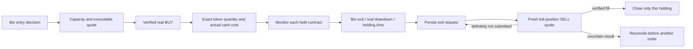

# Managed real positions

The optional managed trial supports **up to two distinct tokens per Bio**. Entries still originate in that Bio's paper-policy feed. Exits track the real ledger, so a paper SELL followed by HOLD cannot silently abandon a real holding. This is implemented and tested with isolated receipts; a funded managed-portfolio run remains unverified.



## Entry and exit rules

- `max_positions` accepts one or two. Adding to an existing token remains disabled. The browser compares every existing token with the recorded portfolio before submitting, and verifies that an unrelated holding did not change during settlement.
- `allow_exploration` can explicitly admit the Bio's labeled exploration entries. It does not turn exploration into a positive model prediction. The default remains false.
- `sell_cooldown_seconds: 0` removes the entry cooldown from exits. Entry cooldown and spending limits apply independently.
- A matching Bio SELL after the real entry becomes a persistent exit request. Every new attempt records its original source and a distinct attempt ID. Paper position removal or a later HOLD does not cancel it.
- Actual entry cash debit and exact acquired quantity determine the real position cost basis. A fresh reference price drives the configurable drawdown exit, default 15%. This reference valuation does not include the future executable exit fee.
- A fresh matching Bio readout can request an exit after the minimum holding time, default 120 seconds. Its model still comes from paper-market training.
- The maximum real holding time defaults to 30 minutes. This is a configured time exit, not a neural decision. The entry-window deadline also requests closure of remaining holdings.
- Held assets remain monitored even after disappearing from the paper portfolio or Trending. If the local market feed lacks a fresh quote, the manager uses public DEX Screener GET observations for that exact chain and contract. Missing prices disable price-based decisions; an already recorded exit or elapsed holding deadline can still request an executable FOMO sell quote.
- Definitively unsubmitted exits are reviewed again after the configured interval, default 30 seconds. Any pending or ambiguous order locks the account against another submit. A platform minimum, missing liquidity, excessive cost or unverified result can still prevent closure; the code cannot guarantee a buyer or a successful fill.

## Fee and quote configuration

`max_fee_usd` is an absolute quoted-cost cap, up to 2 USD. A numeric `max_fee_bps` adds a percentage cap; explicit `null` removes only that percentage gate. For example, a 2 USD absolute cap plus 10% still limits a 5 USD order to 0.50 USD quoted fees. The preview displays whether one or both caps apply.

`max_price_impact_bps` bounds the absolute quoted price impact. `max_slippage_bps` separately bounds native Solana's quoted slippage and the output-deviation check used during receipt reconciliation. It does not modify the platform's quote. When absent, the older shared impact/slippage ceiling is retained. Wider ceilings permit worse execution and are recorded in every intent.

Choose a buy size that leaves room above the platform's sell minimum after costs and price movement. A two-position capacity does not manufacture the cash required to fund two entries. Balances and current executable quotes decide whether an order can proceed.

## Operator startup and lifecycle

Use a separate private configuration with the same account bindings and the existing live journal. Start one Bio explicitly:

```bash
.venv/bin/python scripts/run_fomo_executor.py --config .private/fomo-managed-trial.json --start-live-trial adult --trial-id managed-01 --require-execution-check execution-check-01 --managed-portfolio --trial-entries 2 --trial-seconds 3600
```

`--trial-entries` bounds total entries; it does not require simultaneous purchases or force a BUY. Reaching the entry target prevents further entries while held positions follow their exit rules. Reaching the time deadline requests closure. The program continues managing remaining exits after that deadline, until every position is verified closed or an unresolved result requires reconciliation. Explicit operator stop still stops execution.

`--wait-for-browser` can wait for an existing operator-started executor to release the browser locks. It never stops that process. The new trial's clock starts after acquiring the locks, and a fresh trial still requires an empty, resolved account. A completed prior check is required when specified. No saved enable switch is changed.

Completion requires a verified exit for every entry, exact quantities, matching assets, separate receipts, empty trial holdings and recorded cash changes. `entry_target_reached` distinguishes the full requested entry count from a smaller completed set at the end of the entry window. Zero entries never pass. Restarting a completed trial cannot place another order.

The ledger upgrades its legacy single-position primary key transactionally while preserving quantities and old receipts. Each SELL deletes only its own position. Account identity, mode pins and one unresolved order per account remain enforced.

## What this does not claim

The entry model and its training labels still come from the paper-market pipeline. Real position accounting and persistent exits are now separate from that portfolio, but actual realized cash outcomes do not yet update the learner. The main equity and neural dashboard remains paper data. A passed isolated two-buy/two-sell test is not a funded acceptance result or a profitability test.
