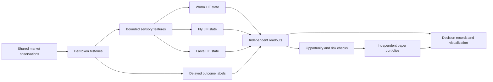

# Methodology

MultiBioArena compares three independently simulated biological networks in a shared market environment. It is an engineering experiment using biological structure, not a claim that the original organisms understand financial markets.

## From market input to a decision

Each token observation becomes bounded positive-return, negative-return, volume, and volatility stimuli applied to annotated sensory pools. A neural observation advances 200 ms using a 0.1 ms LIF time step. Synaptic current decays exponentially; the engine includes delays and refractory periods. Neural state persists between observations within each agent.

Readout pools are averaged by neuron count. Their contrast is calibrated using a fixed synthetic stimulus protocol rather than market profits. A silent readout produces HOLD. Inputs, neural rates, scores, and policy outcomes are recorded separately so a reader can inspect why a neural signal was accepted or rejected.

The same engine and accounting rules support comparison, but differences in sampling time, observation order, cropped inputs, and model assumptions also influence outcomes. These controls do not establish biological fairness.

## Independent token selection

In multi-token mode, each agent checks approximately every 30 seconds with its own seeded ±5-second jitter and staggered initial offset. It reviews held tokens with fresh prices and three rotating new candidates. Five positions plus three new candidates produce at most eight neural observations before an action is selected.

Each contract has a separate price history; histories are never joined across token price scales. Candidate order, token identity, neural input, and output are recorded. Agents may choose the same token or different tokens. A candidate's popularity makes it available for inspection, not automatically eligible for purchase.

## Paper portfolios

Each agent starts with 10,000 virtual USD. Positions use chain-and-contract identities, and each account can hold five tokens. Ordinary entries propose 12% of equity, with 20% per-token and 60% total exposure caps at entry. Prices may subsequently change those fractions.

Estimated costs include 50 bps base fees, 50 bps base slippage, liquidity-dependent impact, and 0.20 USD network cost per order. Orders are capped relative to pool liquidity and recent volume. These are paper-model assumptions, not executable routes or actual gas estimates.

New positions require sufficient liquidity, volume, recent two-way activity, known pool age, and an observation warmup. A fresh response for the same contract after the decision is needed to settle. Missing data never becomes a zero price or fabricated sale. Stale holding valuations block new exposure. Holdings remain recorded even if their token leaves the candidate list.

Risk checks may request exits before ordinary model decisions. Exits can be partial or remain pending because of quote availability, costs, or modeled capacity. No learner can remove these constraints. The reserved live cap is one token per agent, but live execution is not implemented.

## What learns

Each agent trains its own ten-feature linear readout using neural scores and rates, past market features, liquidity, and cost estimates. The underlying connectome remains fixed.

Labels mature at least five minutes after observation and must use fresh quotes from the same pool. The target is a hypothetical long-position log return minus one estimated round-trip cost and an observed downside penalty. Missing or cross-pool labels are discarded. Actual account returns are recorded separately and already include paper costs.

A working readout updates on mature samples. After at least 24 samples, a frozen candidate is evaluated on 12 later observations. It must reduce squared prediction error by at least 5% against both the active readout and a zero baseline to replace the active model. These are chronological prediction checks, not profit backtests.

Initially, a labeled neural/momentum prior guides selection. Bounded paper exploration can allocate at most 3% of equity to an eligible new token when ordinary opportunities are insufficient. Random draws and candidate sets are recorded. Trading frequency itself earns no reward.

## Visualization and provenance

Worm uses a canonical body-axis atlas, with transverse distances expanded for readability. Fly uses measured FlyWire soma coordinates; reference cells remain static. Larva uses real hemisphere and pair annotations in a deterministic organizational layout, not measured anatomy. No complete body or ventral nerve cord reconstruction is claimed.

Short display pulses replay recorded spike bins. Selected-cell edges come from the simulation graph, not fabricated decorative connections. Character gestures visualize recorded decisions; decorative movement is not an input to portfolio accounting or model training.

BUY, SELL, and HOLD are recorded trading decisions. Walking, flight, perching, and apparent rest currently follow presentation schedules; they are not decisions chosen by the readout learner. Market observation, position checks, and training continue while a character is away from its desk. Returning and pressing a button illustrate a recorded action and never gate backend execution.

A secondary behavior policy now records brief activity based on fresh market data, upcoming checks and risk state. It uses a separate random stream and caps excursions without delaying trading or rewarding movement. This backend policy is active after a controlled migration; the frontend uses its recorded states. See [behavior policy](behavior-policy.md).

See [data sources](data-sources.md) for the original publications, source versions, sign assumptions, and coordinate provenance.

## Interpreting results

The useful next comparisons are cash, buy-and-hold, the fixed opportunity policy, and versions with neural readouts removed or shuffled. Evaluation should span multiple market regimes and seeds and report costs, drawdown, and turnover. Differences between agents alone do not establish useful learning, biological causality, or profitability.

We are preparing for live FOMO trading with three isolated accounts and a one-token holding cap per agent. The current release remains paper-only. The learner improves predictions from hypothetical long outcomes; it does not yet learn a complete action-conditioned trading policy or directly optimize verified live profit.
